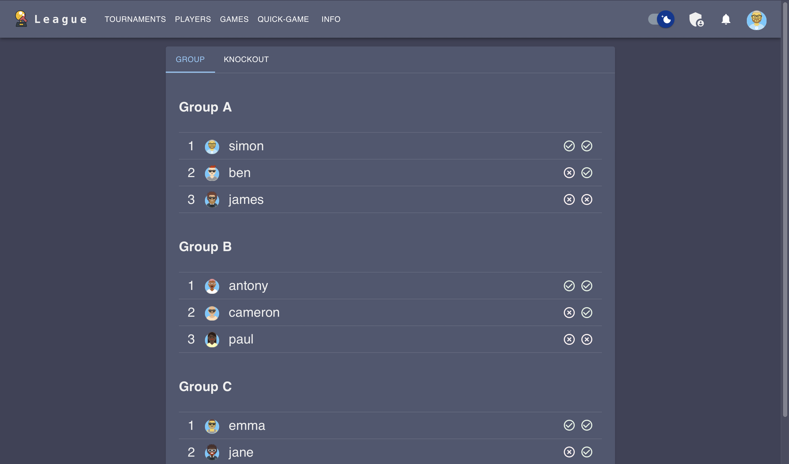

# League

## Project overview

### Features

---

On the home page you will see overview statistics for the site. This will show things such as the number of registered users, how many games have been played etc.

League provides a tournament website that allows you to organise your office, school or local tournament. There is an admin user that can create tournaments which start on a particular date. Users of the system can then join tournaments before the starting date, and once the starting date has passed the games will be scheduled.

### There are two types of tournaments.

The first type is a multi-stage tournaments, where there are group stages and select players progress to the knockout rounds, where players win and continue to the next round or lose and get knocked out of the tournament. This progresses until there is a winner.

#### Group stage games in the multi-stage tournament

#### Knockout stage games in the multi-stage tournament

### Notifications

If a score has been submitted and you were involved in the game, you will get a notification.

The second type is round-robbin where everyone plays everyone else. There is no hierarchy to this tournament.

League also provide rating calculations, and updates player's ratings after each game.

## Usage

#### Running with docker

League can be used by running a local postgres server as well as the docker image simona4220/league:v2.

The simplest way to run league is to run the docker file, which can be accomplished by running the command `docker-docker up -d`. This will start a postgres server and the league container on a private docker network with port 80 exposed (Note this does not provide any encryption).

> Note: When using postgres, it is important to escape special characters in your password.

#### Running from source

If you would like to run the application from source, then you will need to set up your own postgres server in advance, or switch to using sqlite (an easier option). This can be done by changing prisma/schema.prisma `provider = 'sqlite'` under the _datasource_ section, and replacing `url = env("DATABASE_URL")` with `url = 'file:./db.sqlite'`. Then run `npx prisma generate` and `npx prisma db push`.

Then run the command `npm run build && npm run start` to start a production server.

### Configuration

If you would like to deploy

### Documentation

### Contributing

All contributions are welcome. Either fix an existing issue or create a pull request for a new issue, and I will have a look at it as soon as possible.

### License

All assets and code are under the [MIT Licesnse](https://opensource.org/license/mit/) and in the public domain unless specified otherwise.
